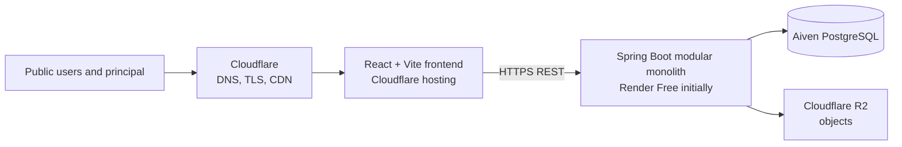
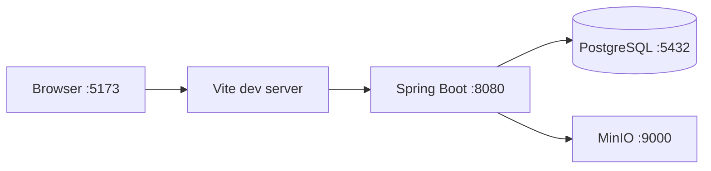

# Architecture

## Overview

The portal is a feature-oriented Spring Boot modular monolith with a separately deployed React frontend. This is the simplest maintainable shape for a small school and one initial administrator. The browser uses HTTPS REST; the backend owns authorization and all database/storage access.

## Components and boundaries

- **Frontend:** feature-oriented pages, forms, API clients, TanStack Query cache, and Gujarati-first UI. It never holds secrets.
- **Backend:** controller → service → repository flow, DTO boundaries, validation, security, and feature packages such as school, academic, assessment, results, materials, notices, gallery, downloads, and admin.
- **PostgreSQL:** relational source of truth, audit metadata, and Spring Session JDBC tables. Use Flyway for every schema change, `snake_case`, UUID external IDs, and `TIMESTAMPTZ` timestamps.
- **Object storage:** an S3-compatible abstraction. Cloudflare R2 in production and MinIO locally. Database rows retain object keys and metadata, never binary file content.

## Security boundary

Only the backend connects to PostgreSQL and object storage. Spring Security authenticates the initial `PRINCIPAL` role; Spring Session JDBC stores server-side sessions in PostgreSQL. Public endpoints remain narrowly scoped. Individual result retrieval must be protected against enumeration and return `Cache-Control: no-store`.

## Local architecture

Docker Compose runs only PostgreSQL and MinIO; frontend and backend may run natively for fast development.

## Intentional constraints

Redis is absent because one backend instance and JDBC-backed sessions are sufficient initially. Microservices are absent because the domain, team, traffic, and deployment needs do not justify distributed complexity. No queue, search cluster, GraphQL, MongoDB, or Kubernetes is planned.

## Scaling path

First improve indexes, caching of safe public content, file delivery through R2/CDN, and backend host capacity. If multiple backend instances become necessary, revisit session strategy, rate limiting, and operational needs with measured evidence. Split services only when a clear ownership, scaling, or reliability boundary outweighs the new complexity.
