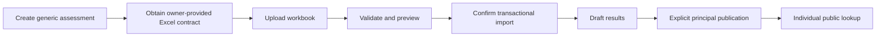

# Key Flows

## Public page load

Browser requests the frontend through Cloudflare; the React app requests only public REST data needed for the page. Public assets are delivered through configured storage/CDN paths. Public data must not reveal admin or private result information.

## Planned Phase 2: principal login and session

The principal will submit credentials over HTTPS. Spring Security will verify the BCrypt password hash, create a server-side Spring Session JDBC record, and return a protected cookie. Admin requests will include CSRF protection and be authorized as `PRINCIPAL`; logout will invalidate the server-side session. The current foundation configures the session schema and security boundary only; it does not implement this flow.

## Content and files

For study material, notices, gallery, downloads, and timetable files, the principal validates metadata in the admin UI. The backend validates authorization, type, size, and storage handling; it stores an object and its metadata/key transactionally as far as possible. Public access is permitted only after the content's intended publication state. If database persistence fails after an object write, cleanup is attempted and the failure is logged for follow-up.

## Assessment and results

The workbook contract is not defined. Do not infer sheet names, columns, marks representation, PIN behavior, or calculations. A published lookup requests only an individual result using the future approved identifiers and must receive `Cache-Control: no-store`.

## School configuration and academic-year transition

The principal changes school-owned settings through a protected admin workflow; public pages read configured data rather than source constants. Academic-year transition is an explicit administrative process: create/select the next year, keep historical records linked to their year, and archive rather than silently rewrite historical data. Exact rollover business rules remain to be specified.
