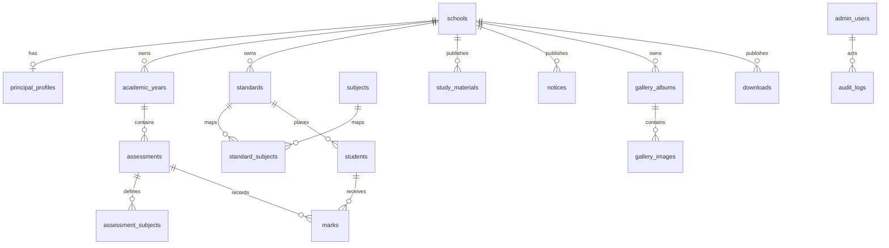

# Planned Database Model

This is a design foundation, not final Flyway SQL. Feature implementation must refine unknown fields and create every schema change through Flyway. Use `snake_case`, internal keys as appropriate, UUID public identifiers for externally exposed entities, and `created_at`/`updated_at` `TIMESTAMPTZ` fields. Avoid hard deletion for important published/auditable records; use explicit archive or publication state where appropriate.

| Table | Purpose and important constraints |
| --- | --- |
| `schools` | Configurable school identity, branding metadata, and public settings; supports portability rather than source constants. |
| `principal_profiles` | Principal-facing public profile associated with a school. |
| `admin_users` | Principal authentication identity; unique normalized email, BCrypt password hash, role, active state. |
| `academic_years` | Named school years, bounded dates when requirements need them, unique identity per school, current/archive state. |
| `standards` | Configurable standards and display ordering, unique per school. |
| `subjects` | Configurable subjects, unique normalized name/code per school as appropriate. |
| `standard_subjects` | Mapping of subjects to standards; unique standard/subject pair. |
| `students` | Minimum approved student identity for results: name, standard, roll number, result PIN hash; exact identity fields remain pending result workflow. Index unique roll number only within the eventual approved academic context. |
| `assessment_types` | Controlled generic assessment type catalog; may be seeded/configured later. |
| `assessments` | Assessment belongs to an academic year and standard/scope; type, title, lifecycle (`DRAFT`, `PUBLISHED`, optionally `ARCHIVED`), and publication metadata. |
| `assessment_subjects` | Subjects included in an assessment; future maximum/passing marks only where requirements approve them. |
| `marks` | Individual marks linked to assessment, student, and assessment subject; exact representation and uniqueness wait for Excel contract. |
| `study_materials`, `downloads`, `notices` | Public/admin content with publication state and object-key metadata for attachments/files. |
| `gallery_albums`, `gallery_images` | Album and ordered image metadata, object keys, captions, and publication state. |
| `audit_logs` | Actor, action, target identifiers, request/correlation context, timestamp, and safe metadata; never store credentials or sensitive payloads. |

Spring Session JDBC creates and owns its session tables according to its configured schema/migration approach; do not treat session records as domain data.

## Files and privacy

File tables retain object key, bucket/category, original display name as safe metadata, content type, size, checksum if needed, and visibility state. Binary payloads never enter PostgreSQL. Index foreign keys, publication/listing fields, normalized public lookup fields, and audit timestamps based on actual query patterns. Public result data is private by policy even though accessed without an account; do not place result details in general caches or logs.
