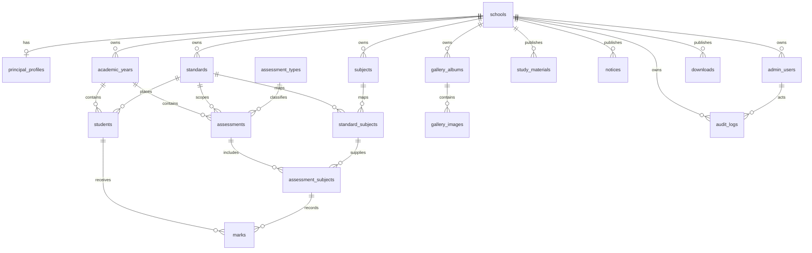

# V1 Database Architecture

This document describes the implemented V1 schema. The only executable schema source is the Flyway migration directory:

```text
backend/src/main/resources/db/migration/
```

`V1__create_spring_session_tables.sql` owns Spring Session JDBC tables. `V2__create_domain_schema.sql` creates the domain schema, `V3__seed_assessment_types.sql` inserts stable generic assessment types, `V4__add_domain_indexes.sql` adds query-focused indexes, `V5__add_admin_authentication_lifecycle.sql` adds the principal password-change lifecycle, `V6__extend_v1_content_and_assessment_metadata.sql` extends school/principal metadata, and `V7__add_admin_support_and_schema_fixes.sql` adds non-blank check constraints and student roster indexes. Do not maintain a second schema script.

All domain identifiers are UUIDs, timestamps are `TIMESTAMPTZ`, and database names are `snake_case`. Hibernate validates this schema but never creates or updates it.

## Relationship overview



## Tables

| Table | Purpose and important rules |
| --- | --- |
| `schools` | Reusable school identity and public contact/branding metadata. The lowercase URL-safe `slug` is unique. A school cannot be deleted while it owns V1 records. |
| `principal_profiles` | One optional public principal profile per school. `school_id` is unique. |
| `admin_users` | Principal authentication identity. Email is lowercase and unique within a school. The only allowed V1 role is `PRINCIPAL`; BCrypt password hashes are never exposed by APIs. `must_change_password` starts true for bootstrap accounts and is cleared only after a successful password change. |
| `academic_years` | School-owned date-bounded years. `CURRENT` and `ARCHIVED` are the only states; a partial unique index permits only one current year per school. Archiving requires `archived_at`. |
| `standards` | School-configured standard code, display name, ordering, and archive flag. Names are case-insensitively unique per school and new display order is assigned by the service. Standards are never seeded implicitly. |
| `subjects` | School-configured normalized uppercase code, name, ordering, and archive flag. Case-insensitive duplicate names are rejected per school. |
| `standard_subjects` | The allowed standard/subject mapping. A pair is unique and both parents must belong to the same school. |
| `students` | Minimum result identity only: full name, roll number, academic year, standard, archive state, and BCrypt result-PIN hash. There are no addresses, DOBs, parent data, phones, or government IDs. |
| `assessment_types` | Stable global catalog seeded with `EKAM_KASOTI`, `UNIT_TEST`, `PERIODIC_TEST`, `SEMESTER`, `ANNUAL`, and `OTHER`. |
| `assessments` | One generic assessment, scoped to school, academic year, and standard. It has `DRAFT`, `PUBLISHED`, and `ARCHIVED` lifecycle states. Publication/archival timestamps are database-checked. |
| `assessment_subjects` | Subjects included in an assessment. Each entry references a permitted `standard_subject`; duplicate assessment/subject pairs are rejected. |
| `marks` | One numeric score per student, assessment, and assessment subject. Composite foreign keys prove that student and assessment share school, year, and standard; scores cannot be negative. No totals, percentages, grades, maximum marks, absence conventions, or Excel-derived values are stored. |
| `study_materials` | Object-storage metadata for materials, optionally scoped to a year and standard-subject mapping. Binary content is never stored in PostgreSQL. New ImageKit uploads retain the provider file ID for direct deletion. |
| `notices` | Notice body plus one optional complete attachment metadata set. Partial attachment metadata is rejected; owned attachments retain their ImageKit file ID for deletion. |
| `gallery_albums` | School gallery groups with publication lifecycle and an optional cover image constrained to the same album. |
| `gallery_images` | Ordered image metadata and required accessible alt text. Image order is positive, unique, and normalized inside an album. New uploads retain an ImageKit file ID for direct deletion. |
| `downloads` | Published document/timetable-style file metadata, optionally scoped to an academic year. New uploads retain an ImageKit file ID for direct deletion; `category` remains free text until a product vocabulary is approved. |
| `audit_logs` | Append-only administrative event record: safe action/target metadata, request ID, and optional actor. The implemented actions are `LOGIN_SUCCESS`, `LOGIN_FAILED`, and `PASSWORD_CHANGED`. Metadata must be a JSON object and must not contain credentials, PINs, cookies, session IDs, or sensitive payloads. |
| `spring_session`, `spring_session_attributes` | Spring Session JDBC implementation tables. They are not domain tables; deleting a session cascades only to its attributes. |

## Integrity and lifecycle rules

### Scope and identity

- Composite foreign keys carry `school_id` through school-scoped relationships. They prevent a student, standard, subject, or assessment belonging to another school from being connected accidentally.
- Student enrollment identity is unique on `(school_id, academic_year_id, standard_id, roll_number)`. The same roll number is therefore permitted in a different standard, academic year, or school.
- `standard_subjects` is unique on `(standard_id, subject_id)`.
- `marks` is unique on `(student_id, assessment_id, assessment_subject_id)` and is additionally constrained to the assessment and student scope.
- The database owns `created_at` and `updated_at`; an update trigger refreshes `updated_at` for all mutable domain tables. Java code must not manufacture audit timestamps.

### Publication and archive behavior

`assessments`, `study_materials`, `notices`, `gallery_albums`, `gallery_images`, and `downloads` use `DRAFT`, `PUBLISHED`, and `ARCHIVED`. A draft cannot have lifecycle timestamps; published records require `published_at`; archived records require `archived_at`. Public queries must filter to `PUBLISHED` and observe parent visibility, such as an album's state for gallery images. For galleries, the album is the principal publication boundary: publishing synchronizes non-archived image status, and unpublishing synchronizes published images back to draft.

Important academic and result records use `ON DELETE RESTRICT`. Their historical references must be archived rather than removed. Gallery images use `ON DELETE CASCADE` from their album because images have no independent meaning. Gallery deletion removes ImageKit objects before corresponding metadata and surfaces storage errors for retry; the database intentionally does not attempt to coordinate object deletion with ImageKit. `cover_image_id` uses a composite foreign key so an album cannot reference an image from another album, and its `ON DELETE SET NULL` behavior remains a final database safeguard.

### Academic configuration lifecycle

- An unused Standard may be deleted together with its unused standard-subject mappings. Standards referenced by students, assessments, materials, or assessment subjects cannot be deleted and may instead be archived.
- An unused Subject may be deleted with its unused standard-subject mappings. A Subject whose mapping is used by materials or assessments cannot be deleted; archiving keeps historical records intact while removing it from future assignment.
- Removing a Subject from one Standard deletes only that mapping, never the global Subject catalogue record. The service rejects that removal when the mapping is historically referenced.

### Result PIN and privacy

`students.result_pin_hash` accepts only the standard 60-character BCrypt `$2a`, `$2b`, or `$2y` representation. PIN plaintext, PIN logs, and reversible encryption columns are prohibited. This prepares secure lookup storage only; the eventual lookup input and workbook behavior remain pending the owner-provided Excel contract.

## Indexes and expected access paths

Unique and foreign-key backing constraints provide direct identity paths. `V4` adds only the following additional indexes:

| Index | Reason |
| --- | --- |
| `students_school_year_standard_name_idx` | Active student administration lists and name lookup inside an academic scope. |
| `subjects_school_normalized_name_unique` | Prevents case-only duplicate subject names. |
| `assessments_public_lookup_idx` | Published assessment selection for individual-result lookup. |
| `marks_assessment_student_idx` | Loads one student’s marks without scanning a class. |
| `study_materials_published_filter_idx` | Filters public materials by school, year, and mapped subject. |
| `notices_published_list_idx` | Lists public notices newest first. |
| `gallery_albums_published_list_idx`, `gallery_images_published_order_idx` | Lists public albums and their ordered visible images. |
| `downloads_published_filter_idx` | Filters published downloads and timetables. |
| `audit_logs_school_created_at_idx` | Reviews recent school administrative activity without indexing JSON metadata. |

These indexes are deliberately partial where only published rows are queried. New indexes require a demonstrated access pattern and an explain-plan review; indexing every column would add write cost without value.

## Transaction boundaries

Future services, not controllers, own transactions.

| Operation | Transaction approach |
| --- | --- |
| Result import | Standard 3 Ekam Kasoti validates the owner-provided format and, in one transaction, replaces only the current year's Ekam Kasoti results after every row maps to a pre-enrolled student. Its Aadhaar column is never read or stored. Other workbook formats, preview, and publication remain pending. |
| Bulk student or marks update | One explicit service transaction with database constraints left enabled; record a safe audit event after success. |
| File metadata and storage | Write the object first to storage, persist metadata including the ImageKit file ID in a transaction, and attempt compensating object cleanup if persistence fails. Deletes remove the provider object first, then metadata; legacy records without a file ID use an exact ImageKit path lookup, and an already-missing legacy object does not block DB cleanup. |
| Publication transition | Change the content or assessment state and audit the event in one transaction. Public endpoints query only committed published state. |
| Academic-year transition | Explicitly create/select the next current year and archive the former one in one service transaction. The partial unique index is the final guard against two current years. |

## Implemented versus deliberately deferred

Implemented: relational structure, status constraints, object metadata, generic numeric marks, password-style result-PIN storage, principal-password lifecycle, JDBC session storage, authentication audit storage, stable assessment-type seeds, JPA model/repository boundaries, PostgreSQL migration testing, and conservative connection-pool configuration.

Deferred: file upload policies, object lifecycle jobs, result publication, public result lookup, and any workbook parsing beyond the documented Standard 3 Ekam Kasoti format. A future requirement must add these through new Flyway migrations; applied migrations are never edited.
